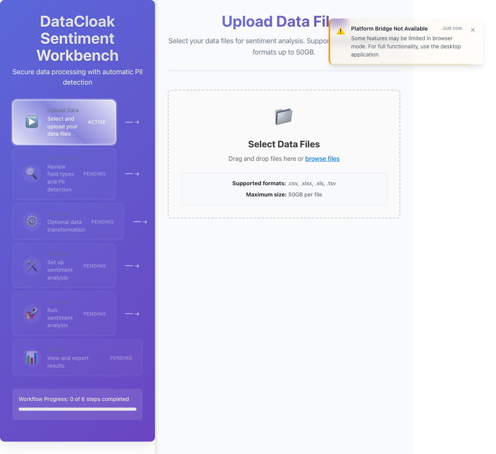
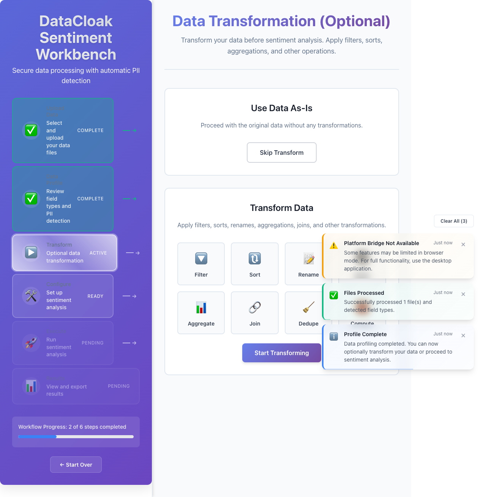
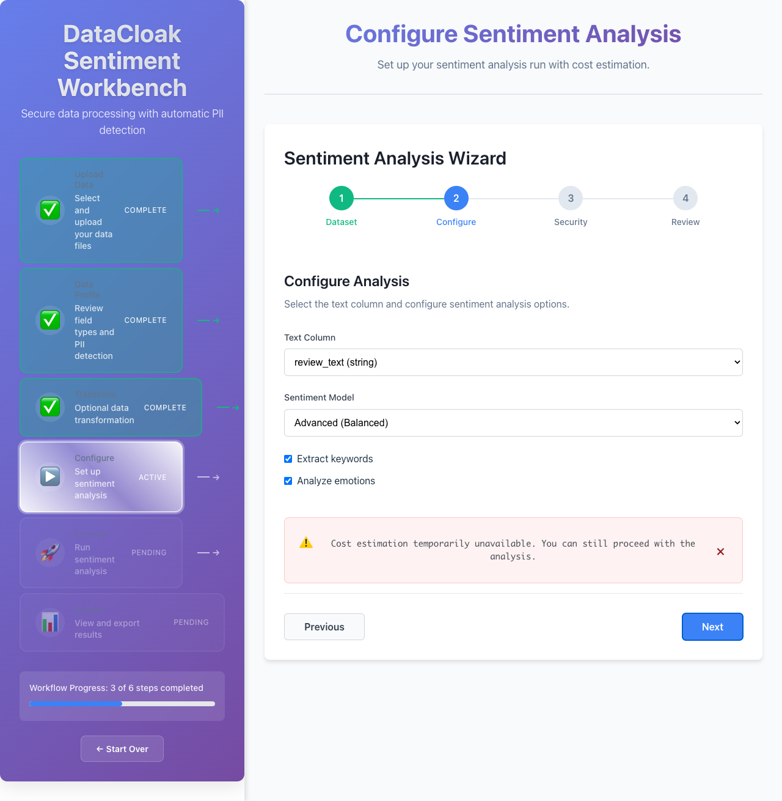
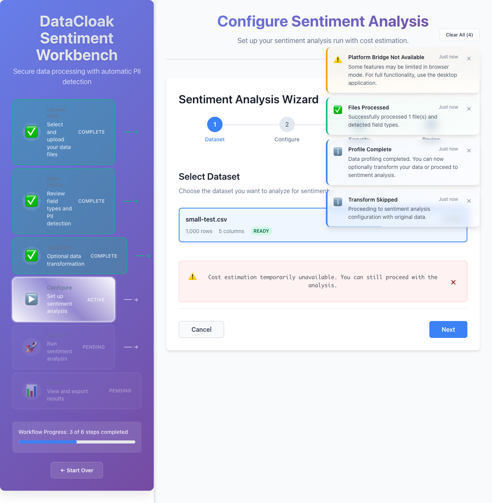
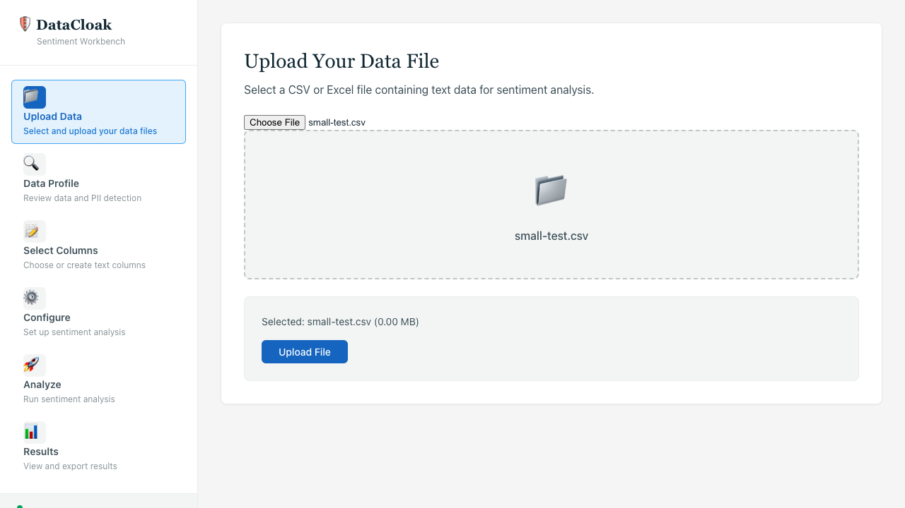
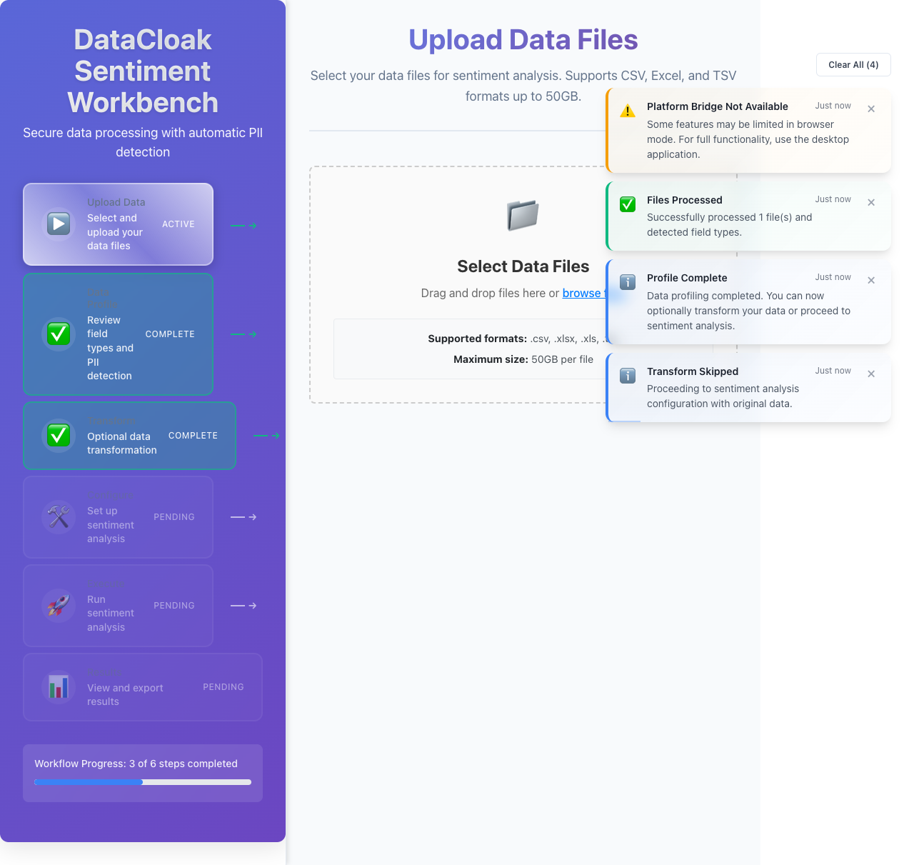
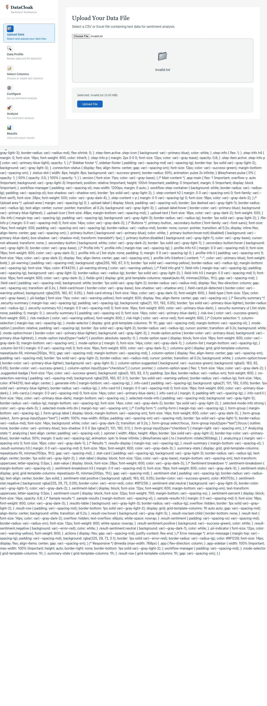
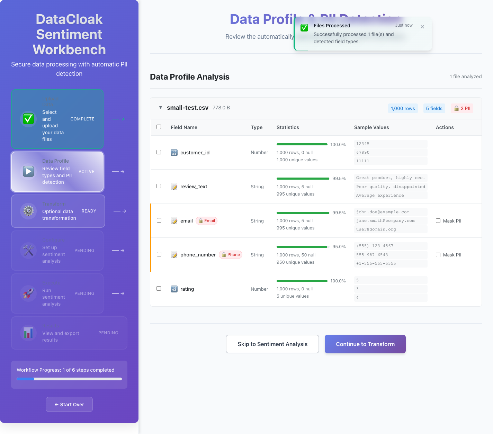

# DataCloak Sentiment Workbench - Quick Reference Card

**Version**: Enhanced DataCloak Integration  
**Date**: 2025-06-16  
**Purpose**: Fast reference for common tasks and workflows

---

## 🚀 Quick Start (5 Minutes)

### 1. Upload → 2. Detect → 3. Configure → 4. Analyze → 5. Export

| Step | Screenshot | Key Actions |
|------|------------|-------------|
| **Upload Data** |  | • Drag & drop CSV/Excel<br>• Supports up to 20GB<br>• Auto-format detection |
| **PII Detection** |  | • Enhanced DataCloak scanning<br>• Red = High risk PII<br>• Yellow = Moderate risk |
| **Analysis Config** |  | • Select GPT model<br>• Choose text columns<br>• Review cost estimate |
| **View Results** |  | • Sentiment breakdown<br>• Confidence scores<br>• Export options |

---

## 📋 Compliance Frameworks

### Quick Selection Guide

| Framework | Use Case | Key PII Types | Risk Level |
|-----------|----------|---------------|------------|
| **🏥 HIPAA** | Healthcare data, patient records | Medical record numbers, patient IDs | Critical |
| **💳 PCI-DSS** | Payment data, financial transactions | Credit cards, bank accounts | Critical |
| **🇪🇺 GDPR** | EU residents, international data | Personal identifiers, IP addresses | High |
| **🔒 General** | Standard business data | Email, phone, addresses | Medium |

### Framework Selection Interface


**Quick Setup**:
1. Choose framework based on your data type
2. Review detected PII patterns
3. Configure confidence threshold (default: 0.8)
4. Enable automatic masking

---

## 🔍 PII Detection Quick Guide

### Color-Coded Risk Levels

| Color | Risk Level | Example PII Types | Action Required |
|-------|------------|-------------------|-----------------|
| 🔴 **Red** | Critical | SSN, Credit Cards, Medical Records | Must mask/encrypt |
| 🟡 **Yellow** | Medium | Names, Addresses, Phone Numbers | Review and consider masking |
| 🟢 **Green** | Low | IDs, Categories, Numeric Values | Safe to process |

### Common PII Patterns

```bash
# Medical (HIPAA)
Medical Record: MRN123456, PATIENT-ID-789012
Provider ID: NPI1234567890, UPIN-AB1234

# Financial (PCI-DSS)  
Credit Card: 4532-0151-1283-0366 (Luhn validated)
Bank Account: 123456789012 (8-17 digits)
IBAN: GB33BUKB20201555555555

# Personal (GDPR)
Driver's License: D1234567, ABC123456789
Passport: P123456789, AB1234567
National ID: Country-specific patterns

# Custom Patterns
Employee ID: EMP123456
Customer Ref: CUST-AB-12345678
Project Code: PROJ_A1B2C3
```

---

## ⚙️ Configuration Cheat Sheet

### Performance Settings

| Setting | Small Files (<100MB) | Large Files (>1GB) | Enterprise (>10GB) |
|---------|---------------------|--------------------|--------------------|
| **Batch Size** | 1000 | 500 | 250 |
| **Concurrency** | 4 | 2 | 1 |
| **Streaming** | Optional | Enabled | Required |
| **Cache** | Enabled | Enabled | Required |

### OpenAI Model Selection

| Model | Speed | Cost | Accuracy | Best For |
|-------|-------|------|----------|----------|
| **GPT-3.5-turbo** | Fast | Low ($0.0015/1K tokens) | Good | Bulk processing |
| **GPT-4** | Slow | High ($0.03/1K tokens) | Excellent | Critical analysis |

### Cost Estimation Formula
```
Total Cost = (Number of Records × Average Tokens) × Model Price per 1K tokens
Example: 1,000 records × 100 tokens × $0.0015 = $0.15
```

---

## 🎯 Common Workflows

### Healthcare Data (HIPAA)


**Quick Steps**:
1. ✅ Select "HIPAA Healthcare" framework
2. ✅ Upload patient data CSV
3. ✅ Verify medical record detection (red fields)
4. ✅ Skip transforms (data usually pre-formatted)
5. ✅ Analyze physician notes/feedback
6. ✅ Export with compliance report

### Financial Data (PCI-DSS)
**Quick Steps**:
1. ✅ Select "PCI-DSS Financial" framework  
2. ✅ Upload transaction data
3. ✅ Verify credit card detection (Luhn validation)
4. ✅ Configure masking for payment fields
5. ✅ Analyze customer feedback
6. ✅ Generate PCI compliance documentation

### European Data (GDPR)
**Quick Steps**:
1. ✅ Select "GDPR European" framework
2. ✅ Upload customer data with EU residents
3. ✅ Check cross-border transfer warnings
4. ✅ Configure data retention policies
5. ✅ Analyze customer sentiment
6. ✅ Export with GDPR impact assessment

---

## 📊 Results Interpretation

### Sentiment Score Breakdown


| Sentiment | Score Range | Interpretation | Action |
|-----------|-------------|----------------|---------|
| **Positive** | 0.6 to 1.0 | Happy customers | Maintain/amplify |
| **Neutral** | -0.1 to 0.6 | Indifferent | Investigate/improve |
| **Negative** | -1.0 to -0.1 | Unhappy customers | Address issues |

### Confidence Levels
- **90-100%**: High confidence, reliable results
- **80-89%**: Good confidence, generally reliable
- **70-79%**: Moderate confidence, review manually
- **<70%**: Low confidence, requires verification

---

## 🔧 Troubleshooting Quick Fixes

### File Upload Issues

| Problem | Quick Fix | Screenshot Reference |
|---------|-----------|---------------------|
| File too large | Enable streaming mode |  |
| Invalid format | Check CSV structure, use UTF-8 |  |
| Upload timeout | Reduce file size or check network |  |

### Processing Issues

| Problem | Quick Fix | Prevention |
|---------|-----------|------------|
| API rate limit | Reduce request rate to 1/sec | Use smaller batches |
| Memory errors | Enable streaming, reduce batch size | Process in chunks |
| PII false positives | Increase confidence threshold | Use custom patterns |

### Export Problems

| Problem | Quick Fix | Alternative |
|---------|-----------|-------------|
| Large export fails | Filter results, export in batches | Use streaming export |
| Format errors | Check data encoding | Try different format |
| Download timeout | Reduce dataset size | Use chunked downloads |

---

## 🛡️ Security Quick Checks

### Pre-Processing Checklist
- ✅ Compliance framework selected
- ✅ PII detection confidence ≥ 80%
- ✅ High-risk fields identified (red)
- ✅ Masking rules configured
- ✅ Audit logging enabled

### Post-Processing Validation
- ✅ Risk score reviewed
- ✅ Compliance violations addressed
- ✅ Export permissions verified
- ✅ Audit trail complete
- ✅ Data retention policy applied

### Critical Security Alerts
| Alert Type | Meaning | Immediate Action |
|------------|---------|------------------|
| **🚨 Critical PII Detected** | SSN, Credit Cards, Medical Records found | Enable masking/encryption |
| **⚠️ Compliance Violation** | Framework rules not met | Review and remediate |
| **🔍 Low Confidence Detection** | Uncertain PII classification | Manual review required |

---

## 📈 Performance Monitoring

### Real-time Metrics


| Metric | Good | Needs Attention | Critical |
|--------|------|----------------|----------|
| **Processing Speed** | >50 rec/sec | 20-50 rec/sec | <20 rec/sec |
| **Memory Usage** | <2GB | 2-4GB | >4GB |
| **API Response Time** | <100ms | 100-500ms | >500ms |
| **Error Rate** | <1% | 1-5% | >5% |

### Optimization Tips
- **Slow Processing**: Reduce batch size, enable caching
- **High Memory**: Enable streaming, reduce concurrency
- **API Errors**: Lower request rate, check authentication
- **Poor Accuracy**: Adjust confidence threshold, add custom patterns

---

## 📞 Support & Resources

### Quick Help
| Issue Type | Resource | Contact |
|------------|----------|---------|
| **Technical Problems** | [Troubleshooting Guide](./USER_GUIDE.md#troubleshooting) | support@datacloak.com |
| **Compliance Questions** | [Compliance Guide](./USER_GUIDE.md#compliance-frameworks) | compliance@datacloak.com |
| **Performance Issues** | [Optimization Guide](./USER_GUIDE.md#best-practices) | performance@datacloak.com |
| **Training Requests** | [Video Tutorials](./TRAINING_PORTAL.md) | training@datacloak.com |

### Emergency Contacts
- **Security Incidents**: security@datacloak.com
- **Data Breach Response**: incident@datacloak.com  
- **24/7 Critical Support**: +1-800-DATACLOAK

---

## 🔗 Quick Links

| Resource | Description | Link |
|----------|-------------|------|
| **Full User Guide** | Complete documentation | [USER_GUIDE.md](./USER_GUIDE.md) |
| **Visual Workflow** | Step-by-step screenshots | [VISUAL_WORKFLOW_GUIDE.md](./VISUAL_WORKFLOW_GUIDE.md) |
| **Technical Reference** | API and configuration docs | [TECHNICAL_REFERENCE.md](./TECHNICAL_REFERENCE.md) |
| **E2E Test Report** | System verification results | [E2E_TEST_REPORT.md](../E2E_TEST_REPORT.md) |

---

## 📱 Mobile Quick Access

### Essential Mobile Features
- **Responsive Design**: Full functionality on tablets
- **Touch Interface**: Optimized for mobile interactions
- **Offline Viewing**: Cache results for offline review
- **Push Notifications**: Real-time processing alerts

### Mobile Workflow
1. 📱 Upload via mobile browser
2. 🔍 Review PII detection results
3. ⚙️ Configure basic settings
4. 📊 Monitor processing progress
5. 📄 Download results

---

**Version**: Enhanced DataCloak v2.0  
**Last Updated**: 2025-06-16  
**Support**: support@datacloak-workbench.com  
**Documentation**: [Complete Guides](./)