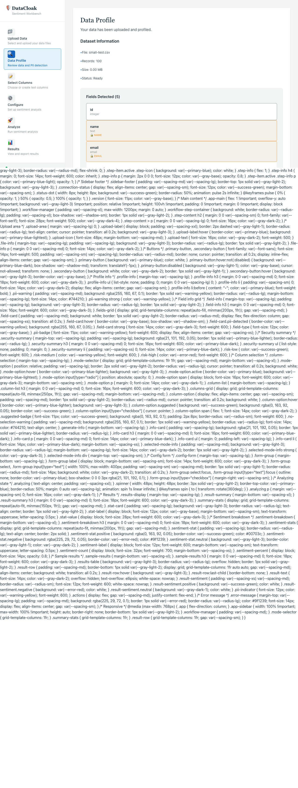
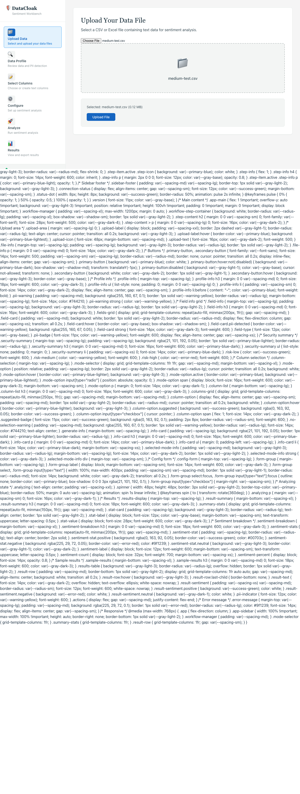

# DataCloak Sentiment Workbench - User Guide

**Version**: Enhanced DataCloak Integration  
**Date**: 2025-06-16  
**Target Audience**: Data Scientists, Compliance Officers, Business Analysts

---

## Table of Contents

1. [Getting Started](#getting-started)
2. [Application Overview](#application-overview)
3. [Step-by-Step Workflow](#step-by-step-workflow)
4. [Enhanced DataCloak Features](#enhanced-datacloak-features)
5. [Compliance Frameworks](#compliance-frameworks)
6. [Advanced Configuration](#advanced-configuration)
7. [Troubleshooting](#troubleshooting)
8. [Best Practices](#best-practices)

---

## Getting Started

### System Requirements
- **Browser**: Chrome 90+, Firefox 88+, Safari 14+, Edge 90+
- **File Size**: Supports files up to 20GB with streaming processing
- **Network**: Stable internet connection for OpenAI integration
- **Permissions**: File access for upload/download operations

### First Launch
When you first launch the DataCloak Sentiment Workbench, you'll see the initial welcome screen:


The application loads with a clean, professional interface featuring:
- Navigation sidebar for workflow steps
- Main content area for interactions
- Status indicators for system readiness
- Help and documentation links

---

## Application Overview

### Core Purpose
The DataCloak Sentiment Workbench is an enterprise-grade platform that combines:
- **Privacy-preserving data processing** using DataCloak PII detection
- **Advanced sentiment analysis** powered by OpenAI
- **Compliance framework support** for HIPAA, PCI-DSS, GDPR, and custom regulations
- **Real-time risk assessment** and monitoring

### Key Capabilities
- ✅ **Enhanced PII Detection**: Medical records, financial data, personal identifiers
- ✅ **Compliance Frameworks**: HIPAA healthcare, PCI-DSS financial, GDPR European
- ✅ **Risk Assessment**: Real-time 0-100 scoring with geographic analysis
- ✅ **Large Dataset Processing**: 20GB+ files with streaming technology
- ✅ **Real-time Monitoring**: WebSocket-based live updates
- ✅ **Professional Reporting**: PDF/Excel compliance reports

---

## Step-by-Step Workflow

### Step 1: Upload Your Data

The first step is uploading your dataset. The application supports various formats and provides real-time feedback:


**Supported File Formats**:
- CSV (Comma-separated values)
- Excel (.xlsx, .xls)
- TSV (Tab-separated values)
- JSON (Structured data)

**Upload Methods**:
1. **Click to Browse**: Use the "Select Files" button
2. **Drag & Drop**: Drag files directly onto the upload area
3. **Large Files**: Automatic streaming for files over 1GB

#### Example: CSV File Upload

Here's an example of uploading a healthcare dataset with PII data:

```csv
patient_id,name,email,phone,ssn,medical_record,diagnosis
P001,John Smith,john.smith@hospital.com,555-123-4567,123-45-6789,MRN001234,Diabetes Type 2
P002,Mary Johnson,mary.j@clinic.org,555-987-6543,987-65-4321,MRN567890,Hypertension
P003,Robert Davis,r.davis@medical.net,555-456-7890,456-78-9012,MRN345678,Cardiac Arrhythmia
```



**What Happens During Upload**:
1. File validation and format detection
2. Initial PII scanning with DataCloak
3. Preview generation (first 100 rows)
4. File statistics calculation
5. Security warning display if PII detected

### Step 2: Enhanced PII Detection & Risk Assessment

After upload, DataCloak automatically analyzes your data for personally identifiable information:


**Enhanced Detection Capabilities**:
- **Medical Data**: Medical record numbers, patient IDs, health information
- **Financial Data**: Credit cards (Luhn validated), bank accounts, IBAN numbers
- **Personal Data**: SSN, driver's licenses, passport numbers, email addresses
- **Geographic Data**: IP addresses, location data for GDPR compliance

**Risk Assessment Features**:
- **Real-time Risk Scoring**: 0-100 scale based on PII sensitivity
- **Compliance Impact**: Automatic framework violation detection
- **Geographic Risk**: Cross-border transfer analysis
- **Confidence Scoring**: ML-powered detection confidence (0.0-1.0)

#### Field Detection Interface


The system automatically detects field types and provides detailed analysis:
- **Field Type Inference**: Automatic categorization
- **Data Quality Metrics**: Completeness, uniqueness, patterns
- **PII Confidence Levels**: Color-coded security warnings
- **Manual Override**: Ability to correct field classifications

### Step 3: Compliance Framework Selection

Choose the appropriate compliance framework for your data:


**Available Frameworks**:

#### 🏥 HIPAA (Healthcare)
- **Use Case**: Medical records, patient data, healthcare analytics
- **PII Focus**: Medical record numbers, patient identifiers, health information
- **Requirements**: Encryption at rest, audit logging, access controls
- **Risk Level**: Critical

#### 💳 PCI-DSS (Financial)
- **Use Case**: Payment processing, financial transactions, banking data
- **PII Focus**: Credit card numbers, bank accounts, financial identifiers
- **Requirements**: Tokenization, secure transmission, regular audits
- **Risk Level**: Critical

#### 🇪🇺 GDPR (European Union)
- **Use Case**: EU citizen data, international transfers, privacy rights
- **PII Focus**: Personal identifiers, IP addresses, location data
- **Requirements**: Consent management, right to deletion, data portability
- **Risk Level**: High

#### 🔒 General Compliance
- **Use Case**: Standard business data, internal analytics, general privacy
- **PII Focus**: Common identifiers like email, phone, address
- **Requirements**: Basic data protection, access logging
- **Risk Level**: Medium

### Step 4: Data Transformation (Optional)

Configure data transformations to prepare your dataset:


**Available Transform Operations**:


1. **Data Filtering**: Remove unnecessary rows or columns
2. **Field Renaming**: Standardize column names
3. **Data Formatting**: Date/time standardization, text cleaning
4. **PII Masking**: Automatic masking based on compliance framework
5. **Field Manipulation**: Data type conversions, calculations

#### Transform Preview


**Features**:
- **Real-time Preview**: See changes before applying
- **Undo/Redo**: Step-by-step transformation history
- **Validation**: Automatic error detection and suggestions
- **Performance Estimates**: Processing time for large datasets

#### Skip Transform Option


You can skip transformations if your data is already properly formatted.

### Step 5: Sentiment Analysis Configuration

Configure the sentiment analysis engine with OpenAI integration:


**Configuration Options**:



1. **Model Selection**: 
   - GPT-3.5-turbo (faster, cost-effective)
   - GPT-4 (higher accuracy, more expensive)

2. **Analysis Parameters**:
   - Sentiment categories (positive, negative, neutral)
   - Confidence thresholds
   - Custom sentiment dimensions
   - Language detection and support

3. **Rate Limiting**:
   - 3 requests per second default
   - Automatic retry with exponential backoff
   - Progress tracking for large datasets

#### Cost Estimation


**Cost Factors**:
- Number of text records to analyze
- Selected OpenAI model (GPT-3.5 vs GPT-4)
- Average text length (token count)
- Current OpenAI pricing rates

**Example Cost Calculation**:
- 1,000 records × 100 tokens average = 100,000 tokens
- GPT-3.5-turbo: ~$0.20 total cost
- GPT-4: ~$3.00 total cost

### Step 6: Analysis Execution

Start the sentiment analysis process:


**During Processing**:
- **Real-time Progress**: Live updates via WebSocket
- **Performance Monitoring**: Processing speed and resource usage
- **Error Handling**: Automatic retry for failed requests
- **Partial Results**: View completed analyses while processing continues

**What Happens**:
1. Text extraction and preprocessing
2. PII masking based on compliance framework
3. OpenAI API calls with rate limiting
4. Sentiment scoring and categorization
5. Result aggregation and statistics

### Step 7: Results Analysis

View comprehensive sentiment analysis results:


**Results Dashboard**:


**Key Metrics**:
- **Overall Sentiment Distribution**: Positive/Negative/Neutral percentages
- **Confidence Scores**: Average ML confidence in predictions
- **Sentiment Trends**: Time-series analysis if date fields present
- **Key Insights**: Most positive/negative themes and topics

**Advanced Analytics**:
- Word frequency analysis
- Emotion detection (joy, anger, fear, surprise)
- Topic clustering and theme extraction
- Comparative analysis across data segments

### Step 8: Export and Reporting

Export your results in multiple formats:


**Export Formats**:
1. **CSV**: For spreadsheet analysis and further processing
2. **Excel**: With charts, formatting, and multiple sheets
3. **JSON**: For programmatic access and API integration
4. **PDF**: Executive reports with visualizations

**Export Features**:


- **Selective Export**: Choose specific columns and rows
- **Data Filtering**: Export only records meeting criteria
- **Compliance Reports**: Automated HIPAA/PCI-DSS/GDPR compliance documentation
- **Encrypted Downloads**: AES-256 encryption for sensitive data

---

## Enhanced DataCloak Features

### Real-time Risk Assessment

The enhanced DataCloak system provides continuous risk monitoring:

**Risk Score Calculation (0-100 scale)**:
- **0-25**: Low risk - minimal PII detected
- **26-50**: Medium risk - standard identifiers present
- **51-75**: High risk - sensitive PII detected
- **76-100**: Critical risk - highly sensitive data requiring immediate protection

**Geographic Risk Analysis**:
- Cross-border data transfer detection
- GDPR applicability assessment
- Data residency requirements
- Jurisdiction-specific regulations

### Advanced PII Detection

**Medical Data (HIPAA)**:
- Medical Record Numbers (MRN): `MRN123456`, `PATIENT-ID-789012`
- Provider IDs: `NPI1234567890`, `UPIN-AB1234`
- Insurance Numbers: `MEDICAID-12345`, `MEDICARE-ABC123`

**Financial Data (PCI-DSS)**:
- Credit Cards: `4532-0151-1283-0366` (Luhn validated)
- Bank Accounts: `123456789012` (8-17 digits)
- IBAN Numbers: `GB33BUKB20201555555555`

**Personal Data (GDPR)**:
- Driver's Licenses: `D1234567`, `ABC123456789`
- Passport Numbers: `P123456789`, `AB1234567`
- National IDs: Country-specific patterns

### Custom Pattern Creation

Create custom PII patterns for your organization:

```regex
Employee ID Pattern: \bEMP[0-9]{6}\b
Customer Reference: \bCUST-[A-Z]{2}-[0-9]{8}\b
Project Codes: \bPROJ_[A-Z0-9]{4,8}\b
```

**Pattern Configuration**:
- Regular expression validation
- Confidence scoring (0.0-1.0)
- Risk level assignment (low/medium/high/critical)
- Compliance framework mapping

---

## Compliance Frameworks

### HIPAA Healthcare Compliance

**Covered Entities**: Healthcare providers, health plans, healthcare clearinghouses
**Business Associates**: Third-party vendors handling PHI

**Key Requirements**:
1. **Administrative Safeguards**: Access management, workforce training
2. **Physical Safeguards**: Facility controls, workstation security
3. **Technical Safeguards**: Encryption, audit logging, access controls

**DataCloak Implementation**:
- Automatic PHI detection and classification
- Encryption at rest using AES-256-GCM
- Comprehensive audit logging with timestamps
- Role-based access controls (RBAC)
- Data retention policy enforcement (7 years)

**Sample Compliance Report Sections**:
```
HIPAA Compliance Assessment
- PHI Elements Detected: 147 instances across 12 categories
- Risk Score: 85/100 (High Risk)
- Violations: 3 potential issues identified
- Recommendations: Implement field-level encryption
```

### PCI-DSS Financial Compliance

**Applicable Organizations**: Merchants, processors, acquirers, issuers, service providers

**12 Core Requirements**:
1. Install and maintain firewall configuration
2. Do not use vendor-supplied defaults
3. Protect stored cardholder data
4. Encrypt transmission of cardholder data
5. Use and regularly update anti-virus software
6. Develop secure systems and applications
7. Restrict access by business need-to-know
8. Assign unique ID to each person with computer access
9. Restrict physical access to cardholder data
10. Track and monitor access to network resources
11. Regularly test security systems and processes
12. Maintain information security policy

**DataCloak Implementation**:
- Luhn algorithm validation for credit card numbers
- Automatic tokenization of payment data
- PCI-compliant data storage (encrypted at rest)
- Access logging for all cardholder data operations
- Secure data transmission protocols

### GDPR European Data Protection

**Territorial Scope**: EU residents' personal data regardless of processing location
**Legal Basis**: Consent, contract, legal obligation, vital interests, public task, legitimate interests

**Key Principles**:
1. **Lawfulness, fairness, transparency**
2. **Purpose limitation**
3. **Data minimization**
4. **Accuracy**
5. **Storage limitation**
6. **Integrity and confidentiality**
7. **Accountability**

**Individual Rights**:
- Right to information
- Right of access
- Right to rectification
- Right to erasure ("right to be forgotten")
- Right to restrict processing
- Right to data portability
- Right to object
- Rights related to automated decision-making

**DataCloak Implementation**:
- Automatic EU personal data detection
- Consent management integration
- Data subject rights automation
- Cross-border transfer monitoring
- Data Protection Impact Assessment (DPIA) support

---

## Advanced Configuration

### Performance Tuning

**Large Dataset Optimization**:
```yaml
batch_size: 1000          # Records per batch
max_concurrency: 4        # Parallel processing threads
streaming_enabled: true   # Enable streaming for >1GB files
cache_enabled: true       # Redis caching for repeated operations
memory_limit: 4GB         # Maximum memory usage
```

**Processing Configuration**:
- **Chunk Size**: 8KB to 4MB for streaming uploads
- **Timeout Settings**: 30s for API calls, 300s for large operations
- **Retry Logic**: Exponential backoff with maximum 5 attempts
- **Rate Limiting**: Configurable per OpenAI tier (default 3 req/s)

### Security Configuration

**Encryption Settings**:
```yaml
encryption_at_rest: true
encryption_algorithm: AES-256-GCM
key_rotation: 90_days
backup_encryption: true
```

**Access Controls**:
- **Role-Based Access Control (RBAC)**: Admin, Analyst, Viewer roles
- **API Key Management**: Rotating keys with expiration
- **Session Management**: Secure cookies with HttpOnly flag
- **Audit Logging**: All data access and modifications logged

### Monitoring and Alerting

**Performance Metrics**:
- Processing time per record
- Memory usage and garbage collection
- Cache hit/miss ratios
- API response times

**Security Alerts**:
- High-risk PII detection
- Compliance violations
- Unusual access patterns
- Failed authentication attempts

**Real-time Dashboards**:
- Live processing status
- Risk score trends
- System health metrics
- User activity monitoring

---

## Troubleshooting

### Common Issues and Solutions

#### File Upload Problems

**Issue**: "File too large" error
**Solution**: 
1. Enable streaming for files >1GB
2. Check browser memory limits
3. Use file compression before upload
4. Contact administrator for size limit increases

**Issue**: "Invalid file format" error
**Solution**:
1. Verify file is CSV, Excel, TSV, or JSON
2. Check file encoding (UTF-8 recommended)
3. Validate CSV structure (consistent columns)
4. Remove special characters from headers

#### PII Detection Issues

**Issue**: PII not detected correctly
**Solution**:
1. Verify compliance framework selection
2. Check confidence threshold settings (default 0.8)
3. Review custom pattern configurations
4. Contact support for pattern updates

**Issue**: False positive PII detections
**Solution**:
1. Increase confidence threshold to 0.9+
2. Add exclusion patterns for specific formats
3. Use manual field type overrides
4. Configure custom patterns with higher specificity

#### Sentiment Analysis Problems

**Issue**: OpenAI API errors
**Solution**:
1. Verify API key configuration
2. Check rate limiting settings (reduce to 1 req/s)
3. Monitor OpenAI service status
4. Review text length (max 4096 tokens per request)

**Issue**: Slow processing performance
**Solution**:
1. Reduce batch size for concurrent processing
2. Enable caching for repeated analyses
3. Use GPT-3.5-turbo for faster processing
4. Implement text preprocessing to reduce token count

#### Export and Download Issues

**Issue**: Export fails for large datasets
**Solution**:
1. Enable streaming export mode
2. Use data filtering to reduce result size
3. Export in multiple batches
4. Check browser download limits

**Issue**: Compliance report generation errors
**Solution**:
1. Verify all required PII detection completed
2. Check compliance framework configuration
3. Ensure sufficient system resources
4. Contact support for report template issues

### Performance Optimization

#### For Large Datasets (>1GB)

1. **Enable Streaming Processing**:
   ```javascript
   {
     "streaming_enabled": true,
     "chunk_size": "4MB",
     "memory_monitoring": true
   }
   ```

2. **Optimize Batch Processing**:
   ```javascript
   {
     "batch_size": 500,
     "max_concurrency": 2,
     "processing_timeout": 600
   }
   ```

3. **Configure Caching**:
   ```javascript
   {
     "cache_enabled": true,
     "cache_ttl": 3600,
     "cache_warming": true
   }
   ```

#### For High-Volume Usage

1. **Scale Infrastructure**:
   - Increase worker processes
   - Add Redis cluster for caching
   - Implement load balancing
   - Monitor resource utilization

2. **Optimize API Usage**:
   - Use connection pooling
   - Implement request batching
   - Add circuit breakers
   - Monitor rate limits

### Error Codes and Messages

| Code | Message | Resolution |
|------|---------|------------|
| DSW001 | File upload failed | Check file size and format |
| DSW002 | PII detection timeout | Reduce dataset size or increase timeout |
| DSW003 | OpenAI API rate limit | Reduce request frequency |
| DSW004 | Compliance violation detected | Review and approve or modify data |
| DSW005 | Export generation failed | Check system resources and permissions |

---

## Best Practices

### Data Preparation

#### File Organization
1. **Consistent Headers**: Use clear, descriptive column names
2. **Data Quality**: Remove duplicates and validate formats
3. **Encoding**: Use UTF-8 encoding for international characters
4. **Size Management**: Split large files into manageable chunks

#### PII Handling
1. **Minimize Collection**: Only include necessary PII fields
2. **Field Labeling**: Clearly identify PII columns in metadata
3. **Access Controls**: Limit PII access to authorized personnel
4. **Documentation**: Maintain data lineage and processing records

### Compliance Framework Selection

#### HIPAA Healthcare
- **When to Use**: Patient data, medical records, health analytics
- **Key Considerations**: Business Associate Agreements (BAAs)
- **Documentation**: Maintain HIPAA risk assessments

#### PCI-DSS Financial
- **When to Use**: Payment processing, financial transactions
- **Key Considerations**: SAQ (Self-Assessment Questionnaire) compliance
- **Documentation**: PCI compliance validation reports

#### GDPR European
- **When to Use**: EU resident data, international operations
- **Key Considerations**: Data Processing Impact Assessments (DPIAs)
- **Documentation**: Article 30 processing records

### Performance Optimization

#### Processing Efficiency
1. **Batch Size Tuning**: Start with 1000 records, adjust based on performance
2. **Memory Management**: Monitor usage and enable streaming for large files
3. **Caching Strategy**: Enable for repeated operations and pattern matching
4. **Concurrent Processing**: Balance speed with resource consumption

#### Cost Management
1. **Model Selection**: Use GPT-3.5-turbo for cost-effective analysis
2. **Text Preprocessing**: Remove unnecessary content to reduce token usage
3. **Sampling**: Use representative samples for large datasets
4. **Monitoring**: Track API usage and costs regularly

### Security Best Practices

#### Data Protection
1. **Encryption**: Enable encryption at rest and in transit
2. **Access Logging**: Monitor all data access and modifications
3. **Regular Audits**: Conduct periodic security assessments
4. **Incident Response**: Maintain procedures for data breaches

#### User Management
1. **Role-Based Access**: Implement least privilege principles
2. **Regular Reviews**: Audit user permissions quarterly
3. **Strong Authentication**: Use multi-factor authentication
4. **Session Management**: Implement secure session handling

### Monitoring and Maintenance

#### System Health
1. **Performance Metrics**: Monitor processing times and resource usage
2. **Error Tracking**: Log and analyze system errors
3. **Capacity Planning**: Plan for growth and peak usage
4. **Regular Updates**: Keep system components current

#### Compliance Monitoring
1. **Regular Assessments**: Conduct monthly compliance reviews
2. **Violation Tracking**: Monitor and resolve compliance issues
3. **Training Updates**: Keep staff current on regulatory changes
4. **Documentation**: Maintain current compliance documentation

---

## Conclusion

The DataCloak Sentiment Workbench provides a comprehensive platform for privacy-preserving sentiment analysis with enterprise-grade compliance features. By following this user guide, you can effectively:

- ✅ **Process sensitive data** while maintaining regulatory compliance
- ✅ **Generate valuable insights** through advanced sentiment analysis
- ✅ **Monitor and manage risk** with real-time assessment capabilities
- ✅ **Create professional reports** for stakeholders and auditors
- ✅ **Scale operations** to handle enterprise-grade datasets

For additional support, training, or advanced configuration assistance, please contact our support team or refer to the technical documentation.

---

**Support Resources**:
- 📧 Email: support@datacloak-workbench.com
- 📖 Documentation: [Technical Reference](./TECHNICAL_REFERENCE.md)
- 🎥 Video Tutorials: [Training Portal](./TRAINING_PORTAL.md)
- 💬 Community: [User Forum](./COMMUNITY_FORUM.md)