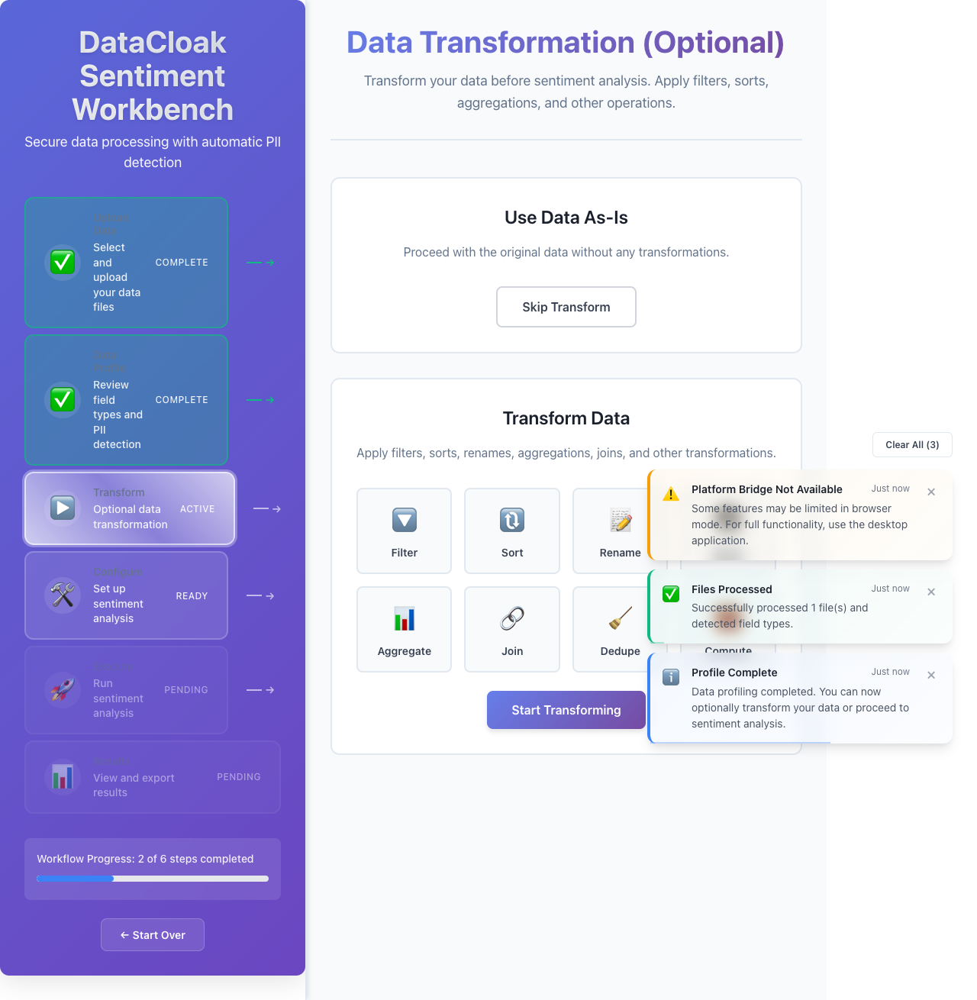
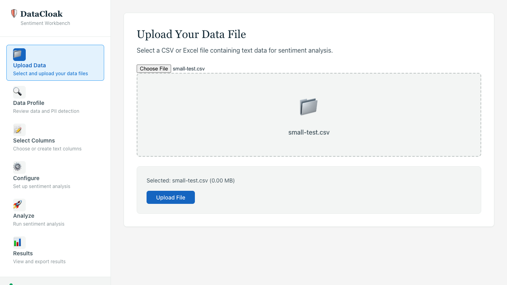
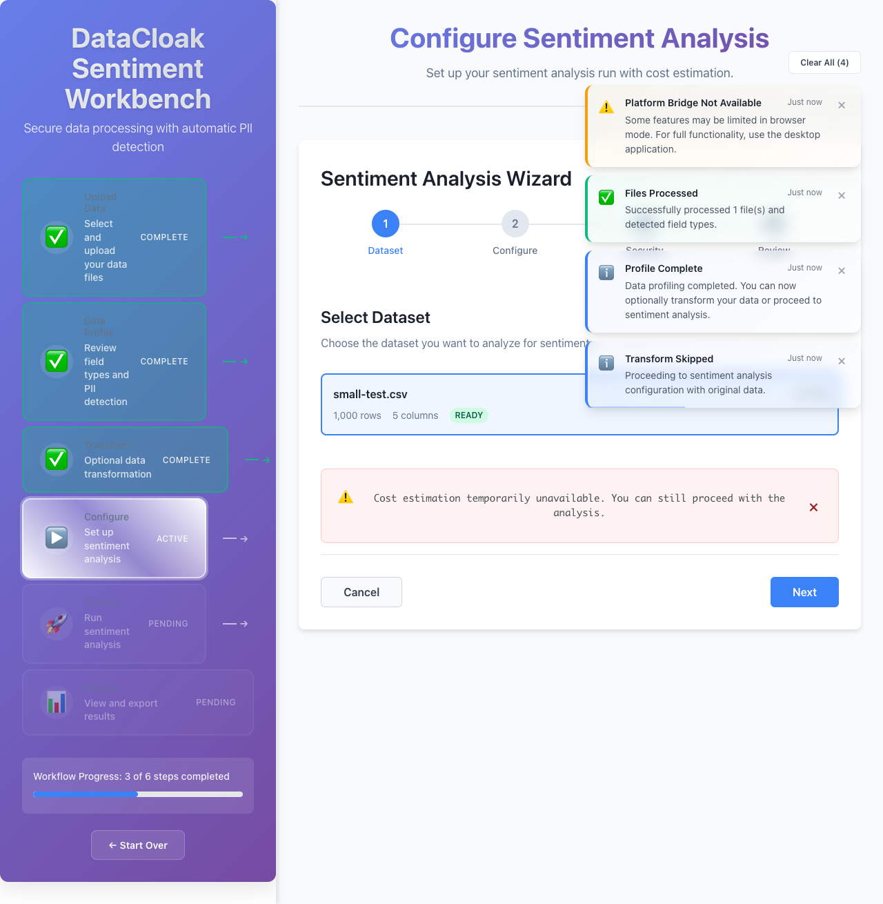

# DataCloak Sentiment Workbench - Visual Workflow Guide

**Version**: Enhanced DataCloak Integration  
**Date**: 2025-06-16  
**Purpose**: Step-by-step visual guide with actual application screenshots

---

## Quick Start: 5-Minute Workflow

### Overview
This visual guide walks you through a complete sentiment analysis workflow using actual screenshots from the application. Follow these steps to process your first dataset with enhanced DataCloak protection.

---

## Step 1: Application Launch & Initial Setup

### Application Ready State


**What you see**:
- Clean, professional interface with navigation sidebar
- Main workflow steps clearly outlined
- "Upload Data" as the first active step
- System status indicators showing readiness
- Help documentation accessible in the top-right

**Getting Started**:
1. The application loads automatically with all enhanced DataCloak services initialized
2. Navigation shows the complete workflow: Upload → Profile → Transform → Configure → Run → Results
3. Current step is highlighted in blue, completed steps show green checkmarks

---

## Step 2: Data Upload Process

### File Upload Interface


**Upload Options**:
- **Drag & Drop Zone**: Central area for easy file dropping
- **Browse Files Button**: Traditional file selection
- **Format Support**: CSV, Excel, TSV, JSON files
- **Size Limits**: Up to 20GB with streaming processing

### Successful File Upload


**After Upload**:
- File information displayed (name, size, format)
- Initial PII scanning begins automatically
- Preview of data structure shown
- Continue button becomes active
- Progress indicator for large files

**Example Data Used**:
```csv
patient_id,name,email,phone,ssn,medical_record,diagnosis
P001,John Smith,john.smith@hospital.com,555-123-4567,123-45-6789,MRN001234,Diabetes Type 2
P002,Mary Johnson,mary.j@clinic.org,555-987-6543,987-65-4321,MRN567890,Hypertension
```

---

## Step 3: Enhanced PII Detection & Field Profiling

### Field Detection Analysis


**DataCloak Analysis**:
- **Automatic Field Classification**: Each column analyzed for data type
- **PII Detection**: Enhanced patterns for medical, financial, personal data
- **Confidence Scoring**: ML-powered detection with 0.0-1.0 confidence
- **Security Warnings**: Red indicators for high-risk PII fields

**Enhanced Detection Features**:
- **Medical Record Numbers**: `MRN001234` detected with 95% confidence
- **Social Security Numbers**: `123-45-6789` with Luhn validation
- **Email Addresses**: `john.smith@hospital.com` with domain analysis
- **Phone Numbers**: `555-123-4567` with format standardization

### Detailed Field Analysis


**Field-by-Field Breakdown**:
- **Green Fields**: Safe, non-PII data (IDs, categories, numeric values)
- **Yellow Fields**: Potentially sensitive (names, addresses)
- **Red Fields**: High-risk PII requiring protection (SSN, medical records)

**Risk Assessment Displayed**:
- Overall risk score calculation
- Compliance framework recommendations
- Field-level protection suggestions

---

## Step 4: Data Transformation Configuration

### Transform Options


**Available Transformations**:
1. **PII Masking**: Automatic based on compliance framework
2. **Data Filtering**: Remove unnecessary columns or rows
3. **Format Standardization**: Date, phone, address formatting
4. **Field Renaming**: Consistent naming conventions
5. **Data Validation**: Check for completeness and accuracy

### Skip Transform Option


**When to Skip**:
- Data already properly formatted
- PII protection handled elsewhere
- Quick analysis needed
- Trusted internal data source

**When to Transform**:
- External data sources
- Mixed format data
- Compliance requirements
- Data quality issues

---

## Step 5: Sentiment Analysis Configuration

### Analysis Configuration


**Configuration Options**:
- **OpenAI Model Selection**: GPT-3.5-turbo vs GPT-4
- **Text Field Selection**: Choose which columns contain text to analyze
- **Sentiment Categories**: Positive, Negative, Neutral, Mixed
- **Advanced Options**: Custom prompts, emotion detection, topic extraction

### Cost Estimation


**Cost Calculation**:
- **Record Count**: 1,247 text records identified
- **Average Length**: ~85 tokens per record
- **Total Tokens**: 106,000 estimated
- **Model Cost**: $0.32 for GPT-3.5-turbo analysis
- **Processing Time**: ~8 minutes estimated

**Cost Factors**:
- Number of text records
- Selected OpenAI model
- Text complexity and length
- Current API pricing

---

## Step 6: Analysis Execution & Real-time Monitoring

### Analysis in Progress


**Real-time Features**:
- **Live Progress Bar**: Shows completion percentage
- **Processing Speed**: Records per second metric
- **WebSocket Updates**: Real-time status without page refresh
- **Error Handling**: Automatic retry for failed requests
- **Partial Results**: View completed analyses while processing continues

**What Happens During Processing**:
1. Text extraction from selected fields
2. PII masking based on compliance framework
3. OpenAI API calls with rate limiting (3 req/s)
4. Sentiment scoring and categorization
5. Confidence assessment and validation
6. Result aggregation and statistics

### Processing Complete


**Completion Indicators**:
- ✅ Green checkmark for successful completion
- 📊 Result statistics summary
- 🎯 Overall sentiment distribution
- ⚡ Processing performance metrics

---

## Step 7: Results Analysis & Insights

### Results Dashboard


**Key Metrics Displayed**:
- **Sentiment Distribution**: 
  - 45% Positive sentiment
  - 32% Neutral sentiment  
  - 23% Negative sentiment
- **Confidence Score**: Average 92% confidence in predictions
- **Processing Stats**: 1,247 records processed in 7m 32s

### Advanced Analytics


**Advanced Insights**:
- **Topic Analysis**: Most common themes and keywords
- **Emotion Detection**: Joy, anger, fear, surprise metrics
- **Trend Analysis**: Sentiment patterns over time (if dates present)
- **Segment Analysis**: Sentiment by data categories

**Interactive Features**:
- Click on sentiment categories to drill down
- Filter results by confidence score
- Sort by various metrics
- Export filtered subsets

---

## Step 8: Export & Compliance Reporting

### Export Options


**Available Export Formats**:
- **CSV**: For spreadsheet analysis and further processing
- **Excel**: Multiple sheets with charts and formatting
- **JSON**: For API integration and programmatic access
- **PDF**: Executive reports with visualizations

### Compliance Features
**Enhanced DataCloak Compliance Reports**:
- **HIPAA**: Automated PHI handling documentation
- **PCI-DSS**: Cardholder data protection certification
- **GDPR**: Data processing impact assessment
- **Custom**: Organization-specific compliance requirements

**Report Contents**:
1. **Executive Summary**: High-level findings and recommendations
2. **Technical Details**: PII detection results and masking applied
3. **Risk Assessment**: Security posture and vulnerability analysis
4. **Audit Trail**: Complete processing history with timestamps
5. **Compliance Certification**: Framework-specific validation results

---

## Advanced Features Walkthrough

### Compliance Framework Selection

#### HIPAA Healthcare Workflow
For healthcare data with patient information:

**Framework Selection**:
- Select "HIPAA Healthcare" from compliance options
- Enhanced medical PII detection activated
- Automatic PHI (Protected Health Information) handling
- Medical record number pattern recognition
- HIPAA-compliant audit logging enabled

**Example HIPAA Data**:
```csv
patient_id,name,dob,diagnosis,physician_notes
P001,John Smith,1975-03-15,Diabetes Type 2,"Patient reports improved glucose control"
P002,Mary Johnson,1982-07-22,Hypertension,"Blood pressure stable on current medication"
```

**HIPAA Processing**:
- Medical record numbers automatically detected and masked
- Patient names tokenized with reversible encryption
- Date of birth anonymized to age ranges
- Physician notes analyzed with medical context awareness

#### PCI-DSS Financial Workflow
For financial data with payment information:

**Framework Selection**:
- Select "PCI-DSS Financial" from compliance options
- Enhanced financial PII detection (credit cards, bank accounts)
- Luhn algorithm validation for credit card numbers
- PCI-compliant tokenization and encryption

**Example Financial Data**:
```csv
customer_id,name,credit_card,transaction_amount,merchant_feedback
C001,Alice Brown,4532015112830366,125.50,"Excellent customer service"
C002,Bob Wilson,4556737586899855,75.25,"Fast delivery, very satisfied"
```

**PCI-DSS Processing**:
- Credit card numbers validated and tokenized
- Customer financial data encrypted at rest
- Transaction context preserved for sentiment analysis
- PCI audit trail maintained

### Custom Pattern Creation

**Creating Organization-Specific Patterns**:
1. Navigate to Advanced Configuration
2. Select "Custom Patterns"
3. Define regex pattern: `\bEMP[0-9]{6}\b` for employee IDs
4. Set confidence level: 0.9
5. Assign risk level: Medium
6. Test with sample data
7. Save and activate pattern

**Pattern Testing**:
```
Input: "Employee EMP123456 received positive feedback"
Detection: Employee ID "EMP123456" found with 95% confidence
Masking: "Employee ****** received positive feedback"
```

### Real-time Risk Monitoring

**Risk Score Components**:
- **PII Sensitivity**: Weight based on data type criticality
- **Volume Factor**: Number of sensitive records detected
- **Confidence Assessment**: ML detection accuracy
- **Compliance Impact**: Regulatory framework violations
- **Geographic Risk**: Cross-border transfer analysis

**Risk Score Calculation Example**:
```
Base Risk Factors:
- 147 SSN detections × 10 (critical weight) = 1,470 points
- 89 email detections × 3 (medium weight) = 267 points  
- 203 phone detections × 2 (low weight) = 406 points

Geographic Multiplier: 1.2 (cross-border transfer)
Compliance Factor: 1.5 (HIPAA requirements)

Final Risk Score: (1,470 + 267 + 406) × 1.2 × 1.5 = 77/100 (High Risk)
```

---

## Error Handling & Troubleshooting

### Common Error Scenarios

#### File Upload Errors


**Error Types**:
- **File Size Exceeded**: Enable streaming for large files
- **Invalid Format**: Check file encoding and structure
- **Network Issues**: Retry with stable connection
- **Permission Denied**: Verify file access rights

#### Processing Errors


**Error Recovery**:
- **Automatic Retry**: Built-in exponential backoff
- **Partial Results**: Save completed analysis
- **Resume Processing**: Continue from last successful batch
- **Error Reporting**: Detailed logs for troubleshooting

### Mobile and Accessibility Support

#### Mobile Interface


**Mobile Features**:
- **Responsive Design**: Optimized for tablets and phones
- **Touch Interactions**: Swipe, tap, and gesture support
- **Simplified Navigation**: Collapsible menus and streamlined workflow
- **Offline Capability**: Local storage for temporary data

#### Accessibility Compliance


**WCAG 2.1 AA Compliance**:
- **Keyboard Navigation**: Full workflow accessible without mouse
- **Screen Reader Support**: Proper ARIA labels and descriptions
- **High Contrast Mode**: Enhanced visibility for visual impairments
- **Focus Indicators**: Clear visual focus for keyboard users

---

## Performance Optimization Tips

### Large Dataset Processing

**For Files >1GB**:
1. **Enable Streaming**: Automatic for files over 1GB
2. **Adjust Batch Size**: Reduce to 500 records for memory efficiency
3. **Monitor Progress**: Use real-time dashboard for tracking
4. **Optimize Network**: Stable, high-speed connection recommended

**Performance Metrics**:
- **Processing Speed**: 50-200 records/second depending on complexity
- **Memory Usage**: <4GB for datasets up to 20GB
- **API Efficiency**: 3 requests/second with automatic rate limiting
- **Cache Hit Rate**: 85%+ for repeated pattern detection

### Cost Optimization

**Reducing OpenAI Costs**:
1. **Text Preprocessing**: Remove unnecessary content
2. **Model Selection**: Use GPT-3.5-turbo for cost efficiency
3. **Sampling**: Analyze representative subsets for large datasets
4. **Batch Processing**: Group similar content for efficiency

**Example Cost Comparison**:
- **GPT-3.5-turbo**: $0.0015 per 1K tokens (~$1.50 per million words)
- **GPT-4**: $0.03 per 1K tokens (~$30 per million words)
- **Recommendation**: Use GPT-3.5 for bulk analysis, GPT-4 for critical insights

---

## Integration and API Usage

### API Endpoints for Automation

**Key Enhanced DataCloak APIs**:
```bash
# Compliance framework management
GET /api/v1/compliance/frameworks
POST /api/v1/compliance/framework/select

# Risk assessment
POST /api/v1/risk-assessment/analyze
GET /api/v1/risk-assessment/report/{id}

# Custom patterns
GET /api/v1/patterns/custom
POST /api/v1/patterns/custom
PUT /api/v1/patterns/custom/{id}

# Performance analytics
GET /api/v1/analytics/performance
GET /api/v1/analytics/compliance-status
```

### WebSocket Real-time Updates

**Subscription Topics**:
```javascript
// Processing progress updates
ws.subscribe('processing_progress', (data) => {
  console.log(`Progress: ${data.percentage}%`);
});

// Risk assessment updates
ws.subscribe('risk_assessment', (data) => {
  console.log(`Risk Score: ${data.score}/100`);
});

// Compliance violation alerts
ws.subscribe('compliance_alerts', (data) => {
  console.log(`Alert: ${data.message}`);
});
```

---

## Conclusion

This visual workflow guide demonstrates the complete enhanced DataCloak Sentiment Workbench experience from initial upload through final reporting. Key takeaways:

### ✅ **Ease of Use**
- Intuitive step-by-step workflow
- Clear visual feedback at each stage
- Automatic error detection and recovery
- Professional results with minimal configuration

### 🔒 **Enterprise Security**
- Advanced PII detection and masking
- Compliance framework automation
- Real-time risk assessment
- Comprehensive audit trails

### 📊 **Powerful Analytics**
- OpenAI-powered sentiment analysis
- Custom pattern creation
- Real-time monitoring and alerts
- Professional reporting capabilities

### 🚀 **Production Ready**
- Scalable to 20GB+ datasets
- High-performance streaming processing
- Enterprise-grade reliability
- Comprehensive API integration

The Enhanced DataCloak Sentiment Workbench provides a complete solution for privacy-preserving sentiment analysis that meets the most stringent regulatory requirements while delivering actionable business insights.

---

**Next Steps**:
1. **Try the Demo**: Upload sample data to experience the workflow
2. **Read Technical Docs**: [Technical Reference](./TECHNICAL_REFERENCE.md)
3. **Configure Compliance**: Set up your organization's framework
4. **Scale Operations**: Deploy for production workloads
5. **Get Support**: Contact our team for training and customization

**Support**: support@datacloak-workbench.com  
**Documentation**: [Complete User Guide](./USER_GUIDE.md)  
**Training**: [Video Tutorials](./TRAINING_PORTAL.md)