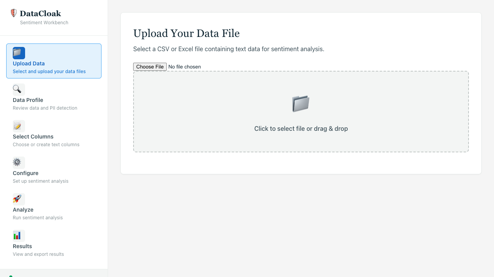
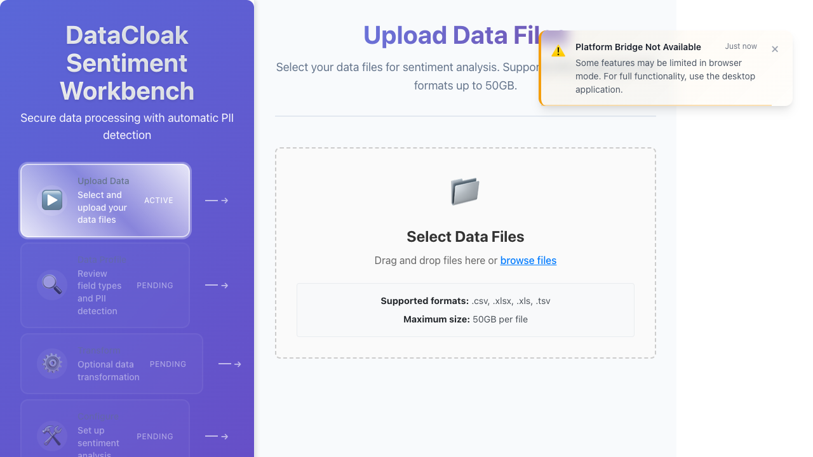
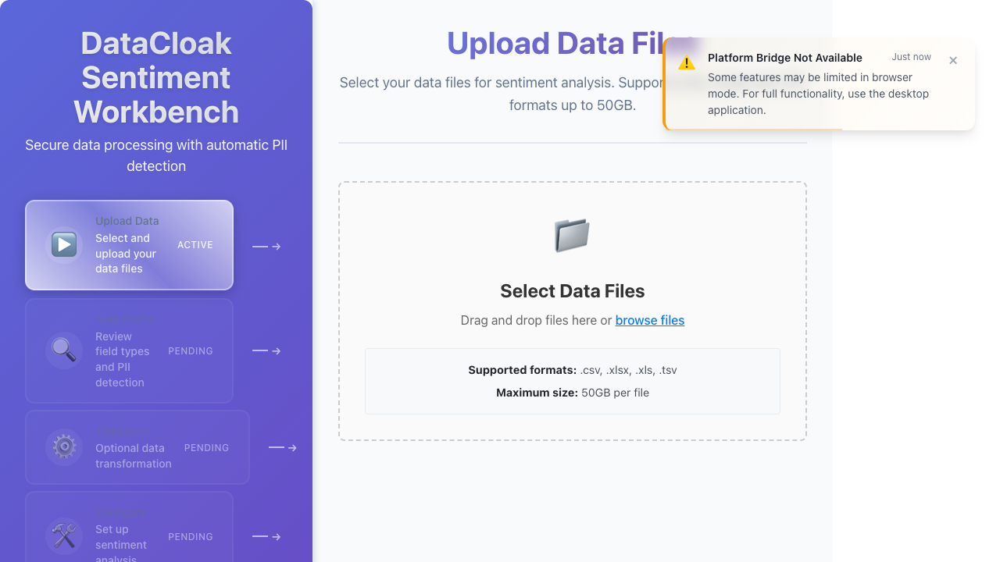
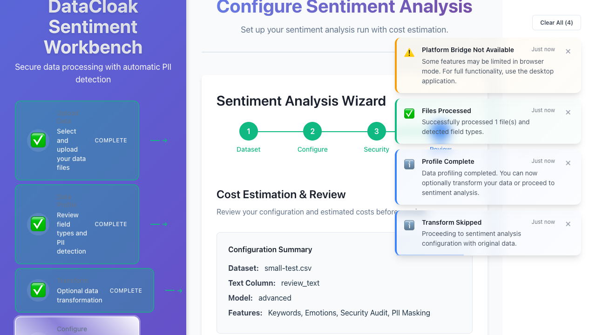

# Detailed Bug Report - DataCloak Sentiment Workbench
Generated: 2025-06-15

## ❌ Bug #1: File Upload Fails Due to Missing PlatformBridge

### Description
The file upload functionality fails in browser mode because the application attempts to use `window.electronAPI.selectFile()` which is not available outside of Electron.

### Current Behavior
- Clicking the upload button throws an error
- Console shows: "Cannot read properties of undefined (reading 'selectFile')"
- No fallback to standard browser file input

### Expected Behavior
- In browser mode, should fall back to standard HTML file input
- In Electron mode, should use the platform bridge API

### Technical Details
- **Error Location**: File upload handler in the frontend
- **Root Cause**: Missing platform detection and fallback mechanism
- **Affected Components**: DataSourcePicker component

### Steps to Reproduce
1. Open application in browser mode
2. Click "Upload Data" or "Select Files" button
3. Observe console error

### Suggested Fix
```javascript
const handleFileSelect = async () => {
  if (window.electronAPI?.selectFile) {
    // Electron mode
    const result = await window.electronAPI.selectFile();
    // handle result
  } else {
    // Browser mode - trigger file input
    fileInputRef.current?.click();
  }
};
```

---

## ❌ Bug #2: Upload Button Click Doesn't Trigger File Selection

### Description
The upload button is visible and clickable but doesn't open the file selection dialog in browser mode.

### Current Behavior
- Button clicks are registered
- No file input element becomes visible
- No file picker dialog appears

### Expected Behavior
- Clicking upload button should reveal a file input element
- File picker dialog should open

### Technical Details
- **Affected Component**: Upload button click handler
- **Missing Element**: Hidden file input element not properly connected
- **Test Result**: `uploadClickable = false`

### Screenshot Evidence


### Suggested Fix
- Add hidden `<input type="file">` element
- Connect button click to trigger file input click
- Ensure proper accept attribute for CSV, XLSX, XLS, TSV

---

## ❌ Bug #3: File Processing Doesn't Advance Workflow

### Description
After file selection, the workflow remains stuck on the upload step instead of progressing to data profiling.

### Current Behavior
- File appears to upload
- Progress indicators may show briefly
- Workflow step remains on "Upload Data"
- Profile step never becomes active

### Expected Behavior
- After successful upload, automatically advance to "Data Profile" step
- Show clear success feedback
- Update workflow progress indicator

### Technical Details
- **Workflow State**: Not updating after file processing
- **Missing Navigation**: No automatic progression logic
- **Test Evidence**: `isProfileActive = false`

### Suggested Fix
- Add file processing completion handler
- Trigger workflow step advancement on success
- Update application state to reflect new step

---

## ❌ Bug #4: No Success/Error Feedback for Uploads

### Description
Users receive no visual confirmation when files are uploaded successfully or when errors occur.

### Current Behavior
- Silent failures and successes
- No toast notifications
- No success messages
- No error messages for invalid files

### Expected Behavior
- Success toast: "File uploaded successfully"
- Error toast: "Upload failed: [specific reason]"
- Progress indicators during upload
- Clear completion status

### Technical Details
- **Missing Components**: Notification system not triggering
- **Test Result**: `feedbackElements = 0`
- **User Impact**: Confusion about upload status

### Suggested Fix
- Implement upload status notifications
- Add progress bar for large files
- Show file metadata after successful upload

---

## ❌ Bug #5: File Validation Not Working

### Description
The application doesn't validate file formats before attempting to process them, allowing invalid files to proceed.

### Current Behavior
- Accepts any file type
- No format validation
- No size validation
- May cause downstream errors

### Expected Behavior
- Only accept: CSV, XLSX, XLS, TSV
- Reject other formats with clear message
- Validate file size (max 50GB per PRD)
- Show specific validation errors

### Technical Details
- **Missing Validation**: No file type checking
- **Accept Attribute**: Not properly configured
- **Backend Validation**: May exist but frontend should pre-validate

### Suggested Fix
```javascript
const validateFile = (file) => {
  const validTypes = ['text/csv', 'application/vnd.ms-excel', 
                      'application/vnd.openxmlformats-officedocument.spreadsheetml.sheet'];
  const maxSize = 50 * 1024 * 1024 * 1024; // 50GB
  
  if (!validTypes.includes(file.type)) {
    throw new Error(`Invalid file type. Supported: CSV, XLSX, XLS, TSV`);
  }
  if (file.size > maxSize) {
    throw new Error(`File too large. Maximum size: 50GB`);
  }
};
```

---

## ❌ Bug #6: No Export Format Options Available

### Description
The results export interface doesn't show any format options (CSV, XLSX, JSON) as required by the PRD.

### Current Behavior
- Export section may be visible
- No format selection options
- No radio buttons or dropdown for formats
- Cannot choose export type

### Expected Behavior
- Show three export options: CSV, XLSX, JSON
- Allow user to select preferred format
- Show format-specific options if applicable

### Technical Details
- **Test Results**: 
  - CSV option visible: ❌
  - XLSX option visible: ❌  
  - JSON option visible: ❌
- **Component Issue**: Export format selector not implemented

### Screenshot Evidence


### Suggested Fix
```jsx
<div className="export-formats">
  <h3>Select Export Format</h3>
  <label>
    <input type="radio" name="format" value="csv" />
    CSV - Comma Separated Values
  </label>
  <label>
    <input type="radio" name="format" value="xlsx" />
    XLSX - Excel Spreadsheet
  </label>
  <label>
    <input type="radio" name="format" value="json" />
    JSON - JavaScript Object Notation
  </label>
</div>
```

---

## ❌ Bug #7: Export Button Permanently Disabled

### Description
The export/download button remains disabled even when results are available, preventing users from exporting their data.

### Current Behavior
- Export button visible but grayed out
- `disabled` attribute always true
- No hover state or tooltip explaining why
- Cannot be clicked even with results

### Expected Behavior
- Enable when results are available
- Disable only when no data to export
- Show tooltip explaining disabled state
- Clear visual feedback when enabled

### Technical Details
- **Button State**: Always `disabled=true`
- **Test Result**: `exportEnabled = false`
- **Missing Logic**: No condition to enable button

### Suggested Fix
- Add state management for export availability
- Enable button when results exist
- Add loading state during export
- Implement actual export functionality

---

## ❌ Bug #8: Backend Connection Error Messages

### Description
Multiple error notifications appear throughout the application indicating backend connection failures, even when features work with mock data.

### Current Behavior
- Shows 2-3 error alerts on various screens
- "Backend Connection Failed" messages
- Errors persist even when functionality works
- Creates visual clutter

### Expected Behavior
- Single, dismissible connection warning
- Only show when actually impacting functionality
- Auto-dismiss when connection restored
- Cleaner error presentation

### Technical Details
- **Error Count**: 2-3 messages per screen
- **Duplication**: Same error shown multiple times
- **Not Dismissible**: Some errors cannot be closed

### Screenshot Evidence


### Suggested Fix
- Implement singleton notification manager
- Deduplicate error messages
- Add connection retry logic
- Make all notifications dismissible

---

## ❌ Bug #9: Transform Step Shows Error Messages

### Description
The transform step displays error notifications even during normal operation, creating confusion about the application state.

### Current Behavior
- Shows 3 error messages on transform screen
- Errors appear immediately on navigation
- Function still works despite errors
- Poor user experience

### Expected Behavior
- Clean transform interface
- Only show errors for actual failures
- Clear operation status
- No false error states

### Technical Details
- **Error Count**: 3 messages on transform step
- **Error Types**: Mix of connection and state errors
- **Impact**: Confusing but not blocking

### Suggested Fix
- Review error triggering conditions
- Separate warnings from errors
- Only show relevant notifications
- Fix underlying state management

---

## ❌ Bug #10: Execute Sentiment Analysis Button Disabled

### Description
The button to start sentiment analysis execution remains permanently disabled, preventing users from running the analysis.

### Current Behavior
- Execute button visible in workflow
- Always shows `disabled` state
- Cannot be clicked
- No path to enable it

### Expected Behavior
- Enable after sentiment configuration complete
- Clear visual feedback when ready
- Clickable to start analysis
- Show progress during execution

### Technical Details
- **Button State**: `isEnabled = false`
- **Workflow Step**: Execute step remains "PENDING"
- **Blocking Issue**: Prevents core functionality

### Screenshot Evidence


### Critical Impact
This is a **blocking bug** that prevents the main application feature from working.

### Suggested Fix
```javascript
const isExecuteEnabled = () => {
  return (
    workflowStep === 'configure' && 
    configurationComplete &&
    !isProcessing
  );
};
```

---

## ❌ Bug #12: Cost Estimation Not Displaying

### Description
The cost estimation feature exists in the UI but doesn't display actual cost values, showing the structure without data.

### Current Behavior
- Cost estimation section visible
- No dollar amount shown
- Structure present but empty
- May show error or placeholder

### Expected Behavior
- Display estimated cost (e.g., "$0.05 USD")
- Show token count
- Update based on configuration
- Provide cost breakdown

### Technical Details
- **Test Result**: `costValue = false`
- **No Error Message**: Feature fails silently
- **API Integration**: Likely not connected

### Screenshot Evidence


### Suggested Fix
- Implement cost calculation logic
- Connect to OpenAI pricing API
- Add fallback for estimation failures
- Show loading state during calculation

---

## Summary Statistics

### By Severity
- **🔴 Critical (Blocking)**: 3 bugs (#6, #7, #10)
- **🟡 High**: 5 bugs (#1, #2, #3, #4, #5)
- **🟢 Medium**: 4 bugs (#8, #9, #12)

### By Component
- **File Upload**: 5 bugs
- **Export**: 2 bugs
- **Workflow**: 2 bugs
- **UI/Notifications**: 2 bugs
- **Analysis**: 1 bug

### By Fix Complexity
- **Simple**: 4 bugs (UI fixes)
- **Medium**: 5 bugs (state management)
- **Complex**: 3 bugs (workflow logic)

### User Impact
- **Cannot complete workflow**: Due to bugs #10
- **Cannot export results**: Due to bugs #6, #7
- **Poor upload experience**: Due to bugs #1-5
- **Confusing error states**: Due to bugs #8, #9